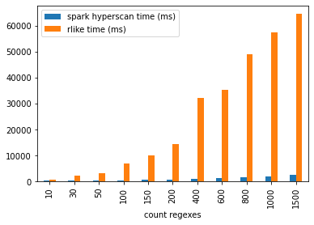

# spark-hscan
This project is [hyperscan](https://github.com/intel/hyperscan) wrapper for spark to allow matching large numbers (up to tens of thousands) 
of regular expressions

## Add it to your project
### Spark shell
```bash
spark-shell --packages ru.napalabs.spark:spark-hscan_2.11:0.1
```
### SBT
```scala
libraryDependencies += "ru.napalabs.spark" % "spark-hscan_2.11" % "0.1"
```
## Usage examples
### SparkSQL
```scala
import ru.napalabs.spark.hscan.implicits._

spark.registerHyperscanFuncs()

val df = spark.sql("""
select * from my_table 
    where hlike(text_field, array("pattern.*", "[a-Z]+other"))"""
)
```
### Scala DSL:
```scala
import ru.napalabs.spark.hscan.functions._

val df = spark.read
         .format("parquet")
         .load("/path/to/files")
df.where(hlike($"text_col"), Array("pattern.*", "[a-Z]+other"))
```
## Benchmark
As a benchmark we used [hsbench](https://01.org/hyperscan/blogs/jpviiret/2017/performance-analysis-hyperscan-hsbench) (teakettle_2500 pattern set and alexa200.db dataset)

## Limitations
See limitations in [hyperscan-java](https://github.com/gliwka/hyperscan-java) project.

Also, this project is only with spark 2.3.2. Compatibility with other versions of spark is not guaranteed.
## Contributing
Feel free to raise issues or submit a pull request.
 
## License
[Apache License, Version 2.0](LICENSE)